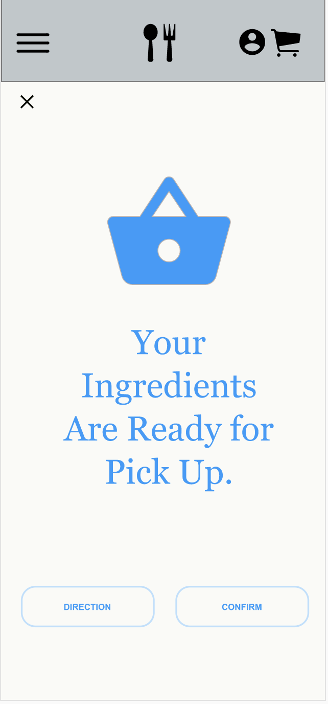

# DH150-Assignment7 - High Fidelity Prototype

## Overview
purpose: The purpose of this Hight-Fdelity test is to visualize the information and validify the interaction flow of how the user's choice will branch out on the App "CookCart". 
Description of Project: This High Fidelity Prototype was done in several phases including usability testing, user personas scenarios, hand-drew low-fidelity wire frames and wireflows. I was able to receive feedbacks from classmates and participants to make easier user flow throughout the process. I was focused on building a easy-to-use cooking recipe app that allows oneself the purchase the ingredients right off the app. I used Adobe Xd and food images from google. 

## Graphic Interface
For ensuring the easy-to-use approach for this app, I considered all the comments from the virtual class review. I has few concerns about the font colors and the size of the buttons. I also made corrections and redesinged the functions such as "filter app" to make sure it does not confuse the users.  
1.   
. 
I changed the filter bar from being on top of the page to a button on the upper left hand corner to make the overall design more clean. 
. 
 
2.   
. 
I had a lot of feedbacks on the contrast of color, so I changed the fonts to darker color from (#2699FB) to black (#070606).   
. 

3.   
. 
For this, I changed the font color along with enlarging the button size to make the tasks easier for the user.   
. 

## Tasks
### Task 1: Looking for recipes that the users want.
In this task, the user first interacts with list of options in the first page of the app. The user is allowed to pick the broad category (Appetizers, Lunch, Dinner, and Breakfast) of their recipes. If they want to narrow down the options or go into an accurate search, they will have the option to apply filter to their searches. The searches give user more detailed options with the selection of main ingredient of the menu, portion size, cooking duration time, cooking level, and calories. After user access to the list of options, they just need to simply click on the recipe that they like to see a video guidance along with descriptive procedure of the recipe, and the list of ingredients. On the bottom of the page, there is a button of "Shop Ingredients" which will lead the user to shop those ingredients that they are missing from the recipe.
### Task 2: Looking for the list of options of nearby grocery store.
After exploring the menu, the user can click on the "shop ingredient" which will directly lead the user to see the list of options of nearby grocery store with the distance. The user will be able to see the list with a little map at the buttom of the page, which will demonstrate an easier process of making choices. If the user picks the store of their convenience, it will lead on to the next page where the app will ask for "delivery" or "Pick up". The user can select from either options which they can have the ingredients that they've added to be delivered or packed and prepared for them to pick it up at the store. This method can be very useful to minimize face-to-face interaction during this unpleasant time. 
### Task 3: Trying to check out the shopping carts.
After the user picks the recipe, the user has the option to check out the ingredients right away, or to save it for later in their cart. When they pick all the options such as which grocery stores, narrowing down the recipes that they need, they will be given the option to check out or to add the ingredients to the bag. When the user taps on the check-out button, they will be directed to payment page where they will need to add their credit card information. After, they can click on the process payment button and will be followed by a page indicating that the order has been placed. It will allow them to track the order status or go back to the main menu on the confirmation page. The user will receive their updates or notifications from the icon on the upper right hand corner. 

## Wireframes - Screenshot of Frames from Each Tasks
### Task 1 : Looking for recipes that the users want.

### Task 2: Looking for the list of options of nearby grocery stroes.

### Task 3: Trrying to check out the shopping carts.

## Interactive Prototype
### Task 1 : Looking for recipes that the users want.
https://xd.adobe.com/view/5192e737-87be-4c33-bd8c-1007db9afc05-04c1/
### Task 2: Looking for the list of options of nearby grocery stroes.
https://xd.adobe.com/view/9547c186-82d8-423e-b47a-a2b4aa35c1ef-c014/
### Task 3: Trrying to check out the shopping carts.
https://xd.adobe.com/view/33bbb3d6-c736-4eff-b60b-538420b27078-66e8/

## Changes from Previous Iterations
Fist, I reorganized the categories on the main menu from Appetizers, Main Dishes, Popular Dishes, and Desserts to Appetizers, Breakfast,Lunch, Dinner. I reorgnized the categories, so that the user's search can arrive in more satisfying results. Instead of placing the filter bar underneath the banner, I embedded the filter option into an icon on the upper left hand corner. I also added a personal notification on the right hand corner, so that the user can check their order status and updates after they place their orders. Additionally, instead of listing the ingredients on the check out page, I created a new page for the check out section to minimize confusion.  
From the feedbacks, I changed the fonts to more darker color and enlarged the crucial function buttons, so that it is more visible for the users. From the user personas and tasks, I mainly focused on the easy-to-use functions and to maximze the convenience of the users in different ages and aspects.

- More Information on the user personas and tasks can be found here :  
https://github.com/geeyunchae/DH150-Assignment5   
- More Information on the Low-fidelity Prototypes can be found here:  
https://docs.google.com/presentation/d/1E56-ncEU0sxBD47r09uu68srVMo9PTEddVgFXbjowuo/edit?usp=sharing  
https://docs.google.com/presentation/d/1b2ONI2hN6F3NBbLEs0OYS90shQ6gfe4-SzAvcnWQ--A/edit?usp=sharing  
